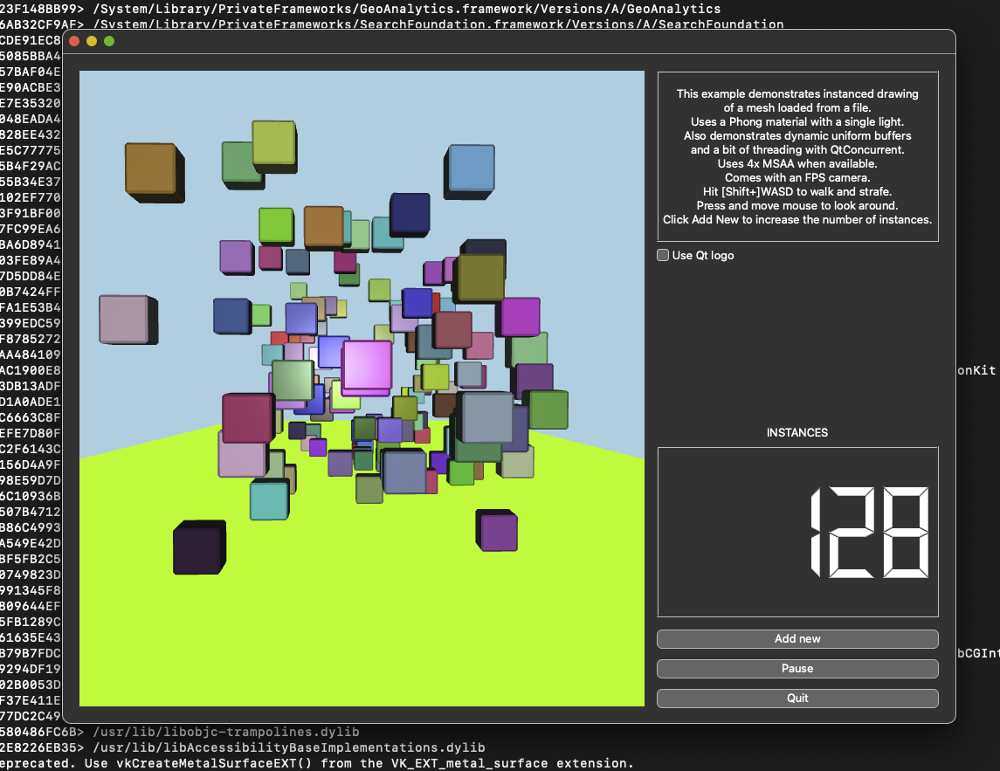

## Qt6.8 + MacOS ARM64 + Vulkan (MoltenVK)



This repo will compile `Qt6.8-beta4` using as many static libraries as possible: 

`openssl3 lcms2 jpeg-turbo expat icu pcre2 graphite2 harfbuzz fontconfig freetype2 again cairo libb2 zstd tiff libwebp pcre2 fontconfig md4c libmng libevent double-conversion brotli libpng`

The Qt build itself is for dynamically linking, so you can follow LGPL3.

The above dependencies are manually installed (see `install_deps.sh`) with the goal of 
creating a folder (`$prefix`) that only contains static libraries (`.a`). We cannot use Homebrew, 
as that will install dynamic libraries (`.dylib`) which the Qt installation will give 
precedence to when looking for libraries (it ignores `CMAKE_FIND_LIBRARY_SUFFIXES`).

This repository also contains patches to both Qt and several libraries to fix 
pkgconfig files, as well as add/modify CMake targets.

### Getting started

There are 3 steps:

1. Prepare directory with static libraries
2. Configure Qt pointing to this library
3. Compile and install Qt

This repository comes with the directory `out/` filled with libraries that have 
been previously compiled. Perhaps these libraries work for you, so that you may skip 
step 1.

Clone this repo to start.

```bash
git clone <this_repo> ~/static                                   
cd ~/static
```

## 1. Install dependencies

For context, as of writing the MacOS SDK (over at `/Applications/Xcode.app/Contents/Developer/Platforms/MacOSX.platform/Developer/SDKs/`) was version 14.

### homebrew stuff

We need some tooling to start.

```bash
brew install autoconf automake libtool python@3.12 virtualenv wget cmake node@22 ccache ninja
```
### produce static libs

```bash
bash install_deps.sh
```

verify that this script successfully completes.

## 2. Configure Qt

```bash
bash configure_qt.sh
```

- **note 1:** Path to Vulkan SDK is hardcoded to version 1.3.290.0, if different, change `configure_qt.sh`. For safety, the script will verify the path.
- **note 2:** Path to Mac OS SDK is hardcoded to version 14, if different, change `configure_qt.sh`. For safety, the script will verify the path.
- **note 3:** To clear build cache, remove the qt6 build directory: `rm -rf qt6/build` then run `configure_qt.sh` again to start fresh.
- **note 4:** `qt6/build/CMakeCache.txt` can be handy for a detailed description of what CMake was able to configure

The output is important, it should look like:

```text
-- Configuring done (29.9s)
-- Generating done (4.7s)
-- Build files have been written to: /Users/foo/static/qt6/build
[*] detect which libraries are .dylib (and maybe need to be .a instead):
/Users/foo/VulkanSDK/1.3.290.0/macOS/lib/libvulkan.dylib
[*] detect any dylib's from brew (probably shouldnt link against homebrew stuff):
[*] also see 'summary.txt' for Qt configure output:
[*] to compile, 1) activate venv 'source venv/bin/activate' 2) 'cd qt6' 3) and:
[...]
```

Verify that:

- the static (.a) libs from `$prefix` are in use
- it does not use libraries from homebrew (.dylib)
- check `summary.txt` for Qt output

### compile

```bash
source venv/bin/activate
cd qt6
cmake --build build --parallel 8 --target qtbase
cmake --build build --parallel 8 --target qtimageformats
cmake --build build --parallel 8 --target qtpositioning
cmake --build build --parallel 8 --target qtdeclarative
cmake --build build --parallel 1 --target qtwebengine
cmake --build build --parallel 8
```

**note**: webengine has parallel 1 to prevent an error, the rest can be 8 threads. The 
final statement just installs everything.

### install

When compiling is done, install Qt6 into `$prefix/build`, for example: `/Users/foo/static/build/`

```bash
cmake --install build
```

## Usage

Then finally, to compile a Qt program against this custom Qt6.8:

```bash
cmake -DCMAKE_PREFIX_PATH="/Users/foo/static/build;/Users/foo/VulkanSDK/1.3.290.0/macOS/" -B build .
```

2 paths are given to `CMAKE_PREFIX_PATH`:
- Path to Vulkan SDK
- Path to Qt

confirm these paths make sense.

### hellovulkancubes

```bash
git clone https://github.com/qt/qtbase.git --depth 1 --branch v6.8.0-beta4 /tmp/qtbase
cd /tmp/qtbase/examples/vulkan/hellovulkancubes
cmake -DCMAKE_PREFIX_PATH="/Users/foo/static/build;/Users/foo/VulkanSDK/1.3.290.0/macOS/" -B build .
make -Cbuild -j8
```

`DYLD_PRINT_LIBRARIES=1 QT_VK_DEBUG=1 QT_LOGGING_RULES="qt.vulkan=true" QT_VULKAN_LIB=/Users/foo/VulkanSDK/1.3.290.0/macOS/lib/libMoltenVK.dylib ./build/hellovulkancubes.app/Contents/MacOS/hellovulkancubes`

note `QT_VULKAN_LIB`; ensure this path is correct.
